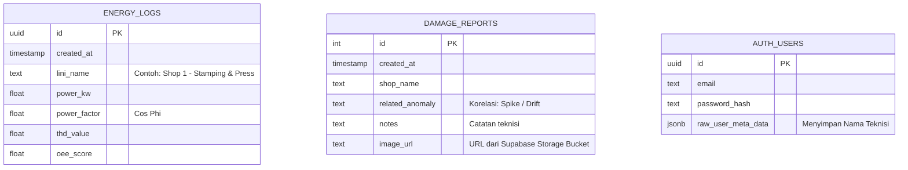

# AEMADS: Advanced Energy Monitoring & Anomaly Detection System
*Industrial Mobile Application for Predictive Maintenance*

---

## 1. Problem Definition (Definisi Masalah)

### Masalahnya Apa?
Keterlambatan dalam mendeteksi **anomali konsumsi energi listrik** (seperti lonjakan daya tiba-tiba / *Spike*, atau penurunan efisiensi secara perlahan / *Drift*) pada mesin-mesin di lini produksi industri manufaktur. 

### Mengapa Ini Menjadi Masalah?
1. **Reaktif, Bukan Proaktif:** Metode pemeliharaan tradisional masih menunggu mesin benar-benar rusak (reaktif) sebelum teknisi bertindak.
2. **Pemborosan Biaya (Downtime):** Jika kerusakan mekanis (seperti kebocoran hidrolik atau ausnya bantalan/bearing) dibiarkan berlarut-larut, mesin akan mogok (*downtime*) dan menyebabkan kerugian finansial yang masif per menitnya.
3. **Visibilitas Terbatas:** Teknisi di lapangan tidak memiliki akses ke data sensor *real-time* secara portabel. Data biasanya hanya bisa dilihat di layar komputer stasioner di Ruang Kontrol Utama (*Control Room*).

---

## 2. Solusi yang Ditawarkan

### Solusi Kami
Kami menawarkan **AEMADS**, sebuah sistem pendeteksi anomali energi berbasis awan (Cloud) yang memantau konsumsi listrik (*Power kW*, *Cos Phi*, *THD*) dari berbagai area pabrik (*Shop*) secara paralel dan *real-time*.

### Bagaimana Mobile App Ini Menjadi Solusi?
Aplikasi Mobile AEMADS memecahkan masalah visibilitas dengan cara:
1. **Mobilitas Penuh:** Mengubah *smartphone* setiap teknisi menjadi terminal dasbor mini. Mereka dapat memantau grafik kelistrikan secara mulus di genggaman tangan saat sedang berpatroli di lantai pabrik.
2. **Peringatan Instan:** Dilengkapi dengan fitur **Global Heatmap** yang akan berkedip merah/kuning sebagai alarm visual instan jika terjadi anomali (Spike/Drift) di area produksi manapun.
3. **Pelaporan Terintegrasi:** Jika terjadi anomali listrik, teknisi bisa langsung menuju lokasi, memotret kerusakan fisik mesin menggunakan kamera aplikasi, dan melaporkannya ke Database Pusat beserta korelasi anomali energinya (*Maintenance Work Order*).

---

## 3. Fitur Utama Aplikasi (Penjelasan Per Halaman)

*   **Halaman Login/Register:** Pintu masuk yang aman. Dilengkapi dengan autentikasi berbasis Cloud (Supabase Auth) untuk memastikan hanya teknisi berizin yang dapat mengakses data pabrik. Saat pendaftaran, teknisi juga bisa langsung memilih "Shop" mana yang menjadi tanggung jawabnya.
*   **Halaman Home (Dashboard):** Pusat kendali utama. Menampilkan:
    *   **Grafik Garis (Real-time):** Menampilkan pergerakan konsumsi listrik (*Power kW*) dari *Shop* yang dipilih secara *live* tanpa *delay*.
    *   **Metrik Angka:** Menampilkan skor *Cos Phi*, THD, dan OEE (*Overall Equipment Effectiveness*) terkini.
    *   **Global Heatmap:** 5 Lampu indikator status seluruh pabrik. Jika pabrik lain mengalami kerusakan listrik, lampu di sini akan berkedip (merah untuk bahaya *Spike*, kuning untuk peringatan *Drift*), memberikan kesadaran global kepada teknisi.
    *   **One-Click Export (CSV & PDF):** Tombol di pojok kanan atas (*Top-Right*) untuk mengunduh/menyimpan riwayat data energi dari pabrik tersebut secara lokal ke dalam format *Spreadsheet* (CSV) maupun Dokumen Cetak (PDF).
*   **Halaman Anomaly History:** Tab riwayat yang mencatat persis pukul berapa, dan seberapa besar sebuah tegangan melewati batas wajar (anomali). Sangat berguna untuk audit teknis.
*   **Halaman Damage Reports:** Menampilkan *feed* layaknya media sosial yang berisi laporan foto-foto mesin rusak dari berbagai teknisi lain. Memudahkan serah-terima (*handover*) pekerjaan antar *shift*.
*   **Halaman Profile:** Menampilkan detail akun teknisi, fitur *Logout*, dan **Dropdown Pintar** yang memungkinkan teknisi "berpindah-pindah" mengawasi grafik pabrik lain (misal dari Stamping ke Paint Shop) secara instan tanpa harus *logout* terlebih dahulu.

---

## 4. Cara Kerja Fitur Kamera (Deep Dive)

Bagi yang penasaran bagaimana aplikasi ini mengambil foto dan mengirimnya ke server, berikut adalah logika sederhananya yang dibungkus dengan sangat canggih:

1. **Jepret (ActivityResultContracts):** Kami tidak membangun aplikasi kamera dari nol karena terlalu berat. Kami "meminjam" aplikasi kamera bawaan HP menggunakan API Android bernama `TakePicturePreview()`.
2. **Kompresi (Bitmap to ByteArray):** Kamera HP modern menghasilkan foto bergiga-giga piksel (2-5MB). Jika langsung dikirim, server akan jebol. Maka, aplikasi kami (di dalam *ViewModel*) akan secara otomatis "memeras" kualitas gambarnya (`Bitmap.CompressFormat.JPEG, 70`) menjadi format ringkas (sekitar 200KB saja).
3. **Penyimpanan Ganda (Cloud Architecture):** 
    *   **Ke Storage Bucket:** Foto yang sudah ringan tadi "diterbangkan" ke brankas raksasa bernama **Supabase Storage**.
    *   **URL Publik:** Storage akan membalas, *"Ini link URL publik dari foto yang barusan kamu kirim"*.
    *   **Ke Database SQL:** Aplikasi kemudian mengirim **Link URL** tersebut (bersama dengan teks catatan kerusakan dan nama pabrik) ke dalam Tabel Database SQL.
    *   **Hasilnya:** Database tetap berukuran sangat kecil (karena hanya menyimpan *link text*), sementara file beratnya terpisah di *bucket* penyimpanan. Ini adalah standar arsitektur kelas industri (seperti cara kerja Instagram).

---

## 5. UML Diagram (Use Case)

```mermaid
usecaseDiagram
    actor Teknisi
    actor Sistem_Backend as "Supabase Server"
    
    package "AEMADS Mobile App" {
        usecase "Login & Pilih Area (Shop)" as UC1
        usecase "Pantau Grafik Energi Real-time" as UC2
        usecase "Lihat Global Alarm Heatmap" as UC3
        usecase "Ambil Foto Kerusakan Mesin" as UC4
        usecase "Kirim Laporan Kerusakan (Cloud)" as UC5
        usecase "Lihat Riwayat Laporan & Anomali" as UC6
        usecase "Download Laporan (PDF/CSV)" as UC7
    }
    
    Teknisi --> UC1
    Teknisi --> UC2
    Teknisi --> UC3
    Teknisi --> UC4
    Teknisi --> UC5
    Teknisi --> UC6
    Teknisi --> UC7
    
    UC1 <.. Sistem_Backend : Autentikasi
    UC2 <.. Sistem_Backend : Streaming WebSocket
    UC5 ..> Sistem_Backend : Upload Foto & Insert Row
```

---

## 6. Arsitektur Database

Menggunakan Supabase PostgreSQL (*Backend-as-a-Service*):



---

## 7. Alur Data (Data Flow) & Peran `generator.py`

```mermaid
flowchart TD
    subgraph IoT_Simulation [Layer IoT / Sensor (Python)]
        G[generator.py]
    end

    subgraph Cloud_Infrastructure [Layer Backend (Supabase)]
        DB[(PostgreSQL Database)]
        R[Realtime Server / WebSockets]
        S[Storage Bucket]
    end

    subgraph Mobile_Application [Layer Frontend (Android)]
        UI[UI Jetpack Compose]
        VM[DashboardViewModel]
    end

    %% Flow Generator
    G -- "1. Generate Data 4 Shop Paralel\n(Setiap 1 detik)" --> DB
    G -. "Menyuntikkan Anomali (Spike/Drift)" .-> DB
    
    %% Flow Realtime
    DB -- "2. REST API / Hard Polling" --> R
    R -- "3. HTTP GET (2s Interval)" --> VM
    VM -- "4. Update UI State" --> UI
    
    %% Flow Camera & Report
    UI -- "Upload Damage Photo" --> S
    S -- "URL Image" --> DB
    UI -- "Insert Damage Data" --> DB
```

### 7.1. Keputusan Arsitektur: Hybrid Hard-Polling vs WebSockets
Dalam pengembangan awal, sistem dirancang menggunakan **Supabase Realtime (WebSockets)**. Namun, untuk versi *Production/Deployment* industri ini, tim memutuskan melakukan *pivot* ke arsitektur **Hybrid Hard-Polling (REST API interval 2 detik)**. 

Berikut adalah justifikasi teknis yang mendasarinya (yang dapat dijelaskan kepada mentor/juri):
1. **Network Constraint & DPI (Deep Packet Inspection)**: Jaringan *Enterprise* (pabrik) dan jaringan publik (seperti Wi-Fi kampus) seringkali memiliki *firewall* yang memblokir koneksi TCP persisten (WebSockets / WSS) untuk mencegah *tunneling*. Hal ini membuat koneksi WebSocket sangat rentan terputus secara diam-diam (*silent drop*).
2. **Kestabilan Sinyal Mobile**: Aplikasi teknisi (AEMADS) digunakan sambil berjalan mengelilingi pabrik. Perpindahan BTS atau *blank spot* membuat WebSocket terputus (*Socket Closed*). REST API (Polling) bersifat *stateless*, sehingga tiap tarikan data adalah *HTTP Request* independen yang jauh lebih tangguh terhadap sinyal *byar-pet*.
3. **Sinkronisasi Otentikasi (RLS)**: Row Level Security (RLS) di Supabase rentan terhadap *Race Condition* jika WebSocket menyambung sepersekian detik sebelum *Token JWT Authentication* selesai dimuat di perangkat Android. Hard-polling menghilangkan risiko otentikasi palsu ini karena *Header HTTP* selalu disuntikkan secara aman pada setiap tarikan.
4. **Efisiensi Beban**: Dengan membatasi *query* hanya menarik 20 baris terbaru (`LIMIT 20` terindeks) setiap 2 detik, beban *server* Supabase tetap sangat minimal (*O(1) time complexity* pada *B-Tree index* PostgreSQL), namun UI Android tetap mendapatkan efek visual *realtime* yang mulus 100%.

### Penjelasan `generator.py` (Simulator IoT)
Karena kita belum memiliki perangkat keras IoT sungguhan yang tersambung ke mesin pabrik, skrip Python `generator.py` bertindak sebagai **Simulator Sensor Cerdas (IoT Dummy)**.
*   **Fungsi Utama:** Skrip ini menghasilkan data konsumsi energi buatan untuk 4 lini produksi (*Shop*) secara paralel setiap 1 detik.
*   **Penyuntikkan Anomali:** Skrip ini dirancang khusus untuk sengaja menyuntikkan lonjakan daya (*Spike > 150 kW*) atau distorsi kualitas listrik (*Drift*) pada interval waktu tertentu, guna memicu respons alarm di aplikasi Mobile Android.
*   **Pengiriman Data:** Menggunakan protokol REST API untuk menginjeksikan data tersebut langsung ke dalam tabel `energy_logs` di Supabase.

---

## 8. Arsitektur Mobile App & Tech Stack

Aplikasi Android ini dibangun menggunakan paradigma modern yang direkomendasikan oleh Google, yaitu **MVVM (Model-View-ViewModel)**.

### A. Arsitektur (MVVM)
*   **Model:** Merepresentasikan data (*Data Class* seperti `EnergyLog`, `DamageReportDB`).
*   **View (`MainActivity.kt`):** Bagian tatap muka aplikasi. Hanya bertugas merender tampilan (UI) tanpa logika bisnis berat.
*   **ViewModel (`DashboardViewModel.kt`):** Jantung aplikasi. Bertugas memegang *state*, mengambil data dari internet, menyaring data, dan memberikan data yang sudah matang untuk ditampilkan oleh View.

### B. Penjelasan Tech Stack
Tim kami menggunakan **4 Tech Stack Ekosistem Modern**, yang jauh melampaui syarat minimal (2 Tech Stack):

1. **Frontend / UI: Jetpack Compose (Kotlin)**
   *Mengapa?* Ini adalah masa depan pembuatan aplikasi Android (menggantikan sistem lama berbasis XML). Memungkinkan kami membangun antarmuka (*UI*) industri berdesain gelap (*Dark Mode*), animasi berkedip (*Heatmap Blink*), dan transisi halaman dengan kode yang jauh lebih ringkas dan *declarative*.

2. **Backend & Autentikasi: Supabase (BaaS)**
   *Mengapa?* Sebagai alternatif Firebase yang menggunakan arsitektur relasional PostgreSQL. Kami menggunakannya untuk:
   *   **Authentication:** Mengelola Pendaftaran & Login Teknisi (Sesi).
   *   **Storage Bucket:** Menyimpan file gambar JPEG dari kamera teknisi ke *cloud* untuk menghindari memori Database kepenuhan.
   *   **PostgREST:** Mengonsumsi dan mengirim data tekstual melalui standar API yang aman.

3. **Asynchronous Operations: Kotlin Coroutines & Flow (Hybrid Polling)**
   *Mengapa?* Daripada bergantung pada WebSockets yang rentan terputus oleh *Firewall* industri dan sinyal pabrik yang tidak stabil (seperti dijelaskan pada poin 7.1), kami menggunakan `viewModelScope.launch` dengan *delay* terkontrol (2 detik) dan `StateFlow`. Ini memastikan aplikasi mendapatkan efek *real-time* yang mulus secara visual, namun tetap sangat tangguh terhadap putusnya jaringan (*Stateless REST API*).

4. **Visualisasi & Media Loading: Vico Chart & Coil**
   *Mengapa?*
   *   **Vico Chart:** Pustaka khusus Compose untuk membuat grafik garis kelistrikan yang mulus dan *hardware-accelerated*.
   *   **Coil (AsyncImage):** Pustaka untuk secara otomatis mendownload gambar laporan kerusakan dari Supabase Storage dan menampilkannya di memori (seperti sistem memuat gambar di Instagram).
